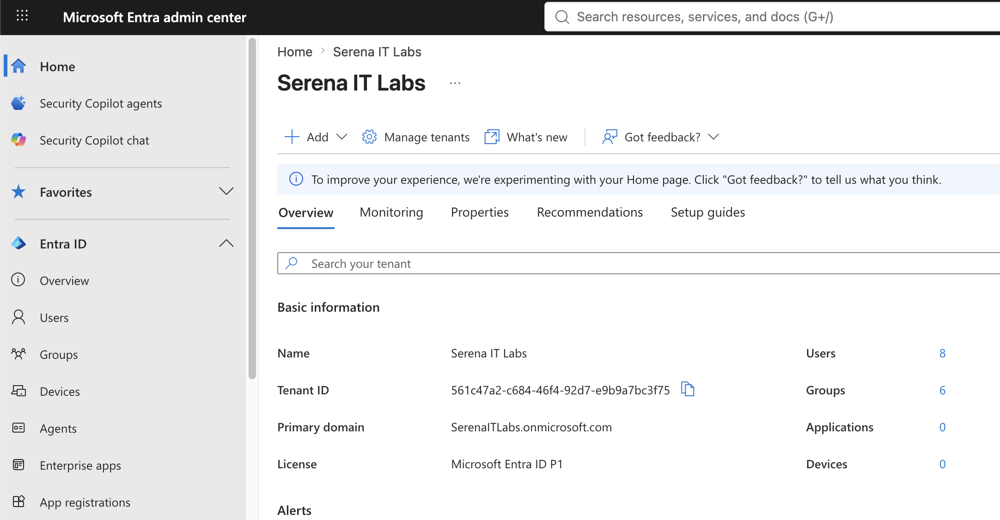
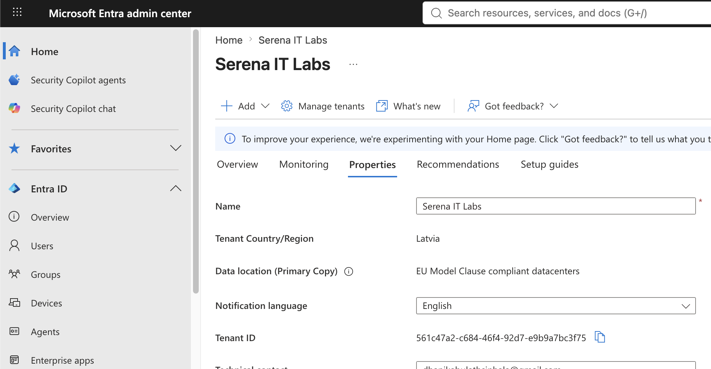
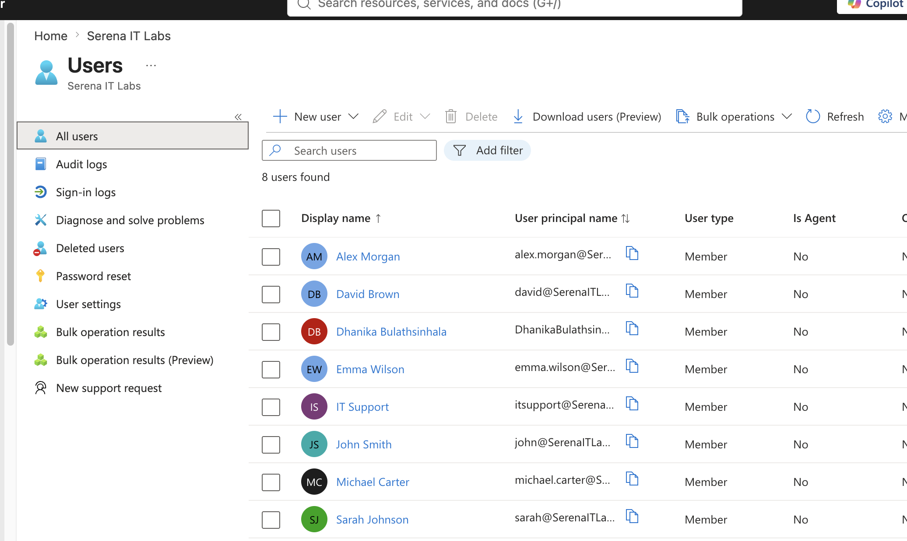
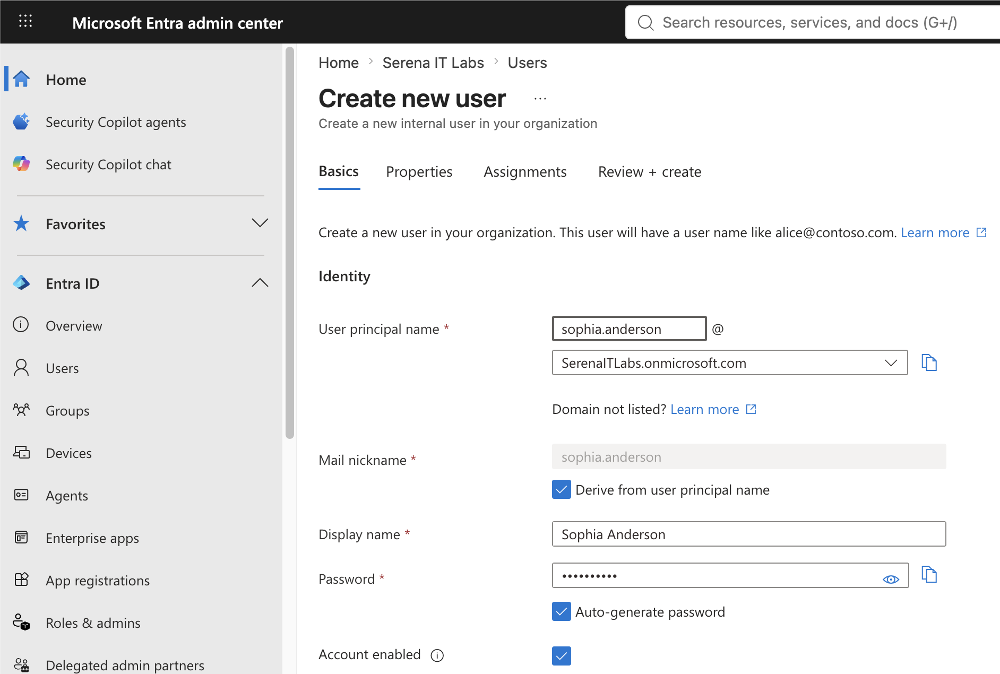
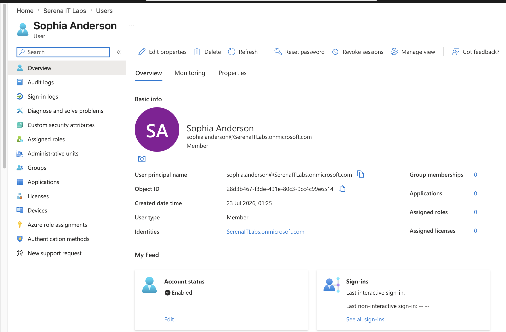
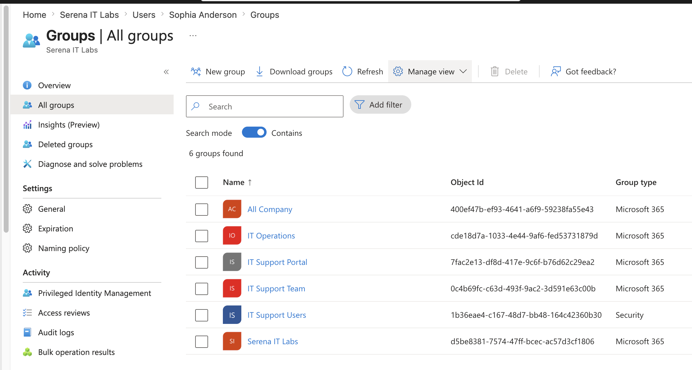
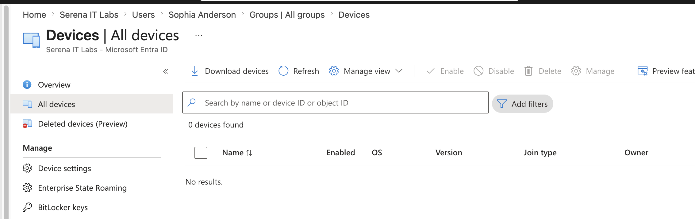
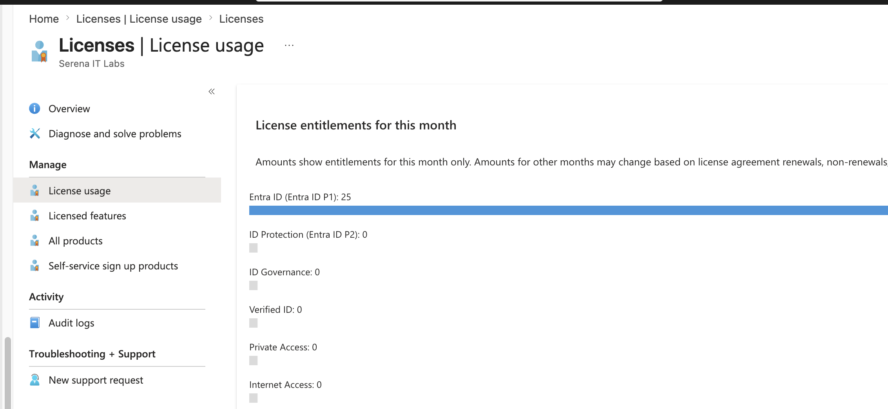

# Project 01 – Microsoft Entra Tenant & Identity Administration

## Overview

This project demonstrates foundational Microsoft Entra ID administration within a Microsoft 365 Business Premium environment.

The lab focused on exploring the Microsoft Entra tenant, reviewing tenant properties, managing cloud identities, creating a standard user account, reviewing groups and device identities, and examining licensing information through the Microsoft Entra Admin Center.

The project establishes the identity-management foundation for later labs involving role-based access control (RBAC), authentication methods, Multi-Factor Authentication (MFA), Conditional Access, and identity troubleshooting.

---

## Scenario

An organization uses Microsoft Entra ID as its cloud identity and access management platform for Microsoft 365.

As the administrator, the task is to review the Microsoft Entra tenant configuration, inspect existing identities, provision a new standard employee account, and examine the core identity objects used to manage users, groups, devices, and licenses.

---

## Objectives

- Navigate the Microsoft Entra Admin Center
- Review the Microsoft Entra tenant
- Review tenant properties
- Review existing user identities
- Create a new cloud user
- Review user identity properties
- Review Microsoft Entra groups
- Review registered devices
- Review tenant licensing
- Understand the relationship between Microsoft Entra ID and Microsoft 365

---

## Lab Environment

| Component | Details |
|---|---|
| Microsoft 365 Plan | Microsoft 365 Business Premium |
| Identity Platform | Microsoft Entra ID |
| Administration Portal | Microsoft Entra Admin Center |
| User Type | Cloud-based organizational users |
| Environment | Cloud-based Microsoft 365 Tenant |

---

## Project Structure

```text
01-Entra-Tenant-and-Identity-Administration
├── README.md
└── Screenshots
    ├── 01_Entra_Tenant_Overview.png
    ├── 02_Tenant_Properties.png
    ├── 03_All_Users.png
    ├── 04_Entra_User_Created.png
    ├── 05_User_Identity_Overview.png
    ├── 06_Entra_Groups.png
    ├── 07_Entra_Devices.png
    └── 08_Entra_Licenses.png
```

---

## Lab Steps

1. Accessed the Microsoft Entra Admin Center.
2. Reviewed the Microsoft Entra tenant overview.
3. Examined tenant properties and directory information.
4. Reviewed existing user identities within the tenant.
5. Created a new standard cloud user named `Sophia Anderson`.
6. Verified that the account was configured as a standard organizational member.
7. Reviewed the new user's Microsoft Entra identity properties.
8. Reviewed existing Microsoft Entra groups.
9. Reviewed registered and joined device identities.
10. Reviewed Microsoft 365 licensing information through Microsoft Entra.
11. Documented the tenant and identity-management environment for future identity and access management labs.

---

## 1. Microsoft Entra Tenant Overview

The Microsoft Entra Admin Center was accessed to review the organization's cloud identity environment.

The tenant overview provides administrators with centralized access to identity-management capabilities including:

- Users
- Groups
- Devices
- Applications
- Administrative roles
- Authentication
- Conditional Access
- Identity monitoring

Understanding the tenant structure provides the foundation for implementing more advanced identity and access controls.



---

## 2. Tenant Properties

Microsoft Entra tenant properties were reviewed to understand the configuration of the organization's directory.

Information reviewed included:

- Tenant name
- Primary domain
- Tenant identifiers
- Directory information
- Access-related configuration

These properties identify and define the Microsoft Entra tenant used by the organization.



---

## 3. Existing User Identities

The **All users** interface was reviewed to examine the identities currently stored within the Microsoft Entra directory.

Microsoft Entra ID provides centralized identity management for users accessing Microsoft 365 and other integrated cloud resources.



---

## 4. Cloud User Provisioning

A new cloud user was created directly through Microsoft Entra ID.

The lab user was configured as:

```text
Name: Sophia Anderson
User Type: Member
Administrative Role: None
```

The account was intentionally created without administrative privileges to follow the principle of least privilege.

This demonstrated basic cloud identity provisioning through the Microsoft Entra Admin Center.



---

## 5. User Identity Review

The newly created user's Microsoft Entra identity object was reviewed.

Identity information examined included:

- Display name
- User Principal Name (UPN)
- User type
- Account status
- Object information
- Account creation information

This demonstrated how Microsoft Entra represents and manages individual organizational identities.



---

## 6. Microsoft Entra Groups

Existing groups within the Microsoft Entra tenant were reviewed.

Groups provide a scalable mechanism for organizing identities and assigning access to organizational resources.

Microsoft Entra groups can be used for scenarios such as:

- Resource access
- Application assignment
- Security permissions
- Microsoft 365 collaboration
- Policy targeting
- License assignment

More advanced group administration and membership scenarios will be covered in the next project.



---

## 7. Device Identities

The Microsoft Entra device inventory was reviewed to identify devices registered or joined to the organization's tenant.

Device identities are important for modern identity and endpoint management because they can be used with technologies such as:

- Microsoft Intune
- Conditional Access
- Device compliance
- Microsoft Entra Join
- Microsoft Entra Registration

Device management will be explored more deeply in the Microsoft Intune portfolio.



---

## 8. Licensing

Licensing information was reviewed through Microsoft Entra ID.

The tenant uses Microsoft 365 Business Premium, which provides the Microsoft cloud services used throughout the administration environment.

Reviewing licensing helps administrators understand which services and identity-management capabilities are available to organizational users.



---

## Identity Administration Workflow

The project established the following basic identity-administration workflow:

```text
Microsoft Entra Tenant
        ↓
Review Tenant Configuration
        ↓
Review Existing Identities
        ↓
Create Cloud User
        ↓
Review Identity Properties
        ↓
Review Groups
        ↓
Review Devices
        ↓
Review Licensing
```

This provides the foundation for implementing more advanced identity and access management controls.

---

## Skills Demonstrated

- Microsoft Entra ID administration
- Microsoft Entra Admin Center navigation
- Cloud identity management
- Cloud user provisioning
- User identity administration
- Tenant configuration review
- User Principal Name (UPN) awareness
- Microsoft Entra group fundamentals
- Device identity awareness
- Microsoft 365 licensing awareness
- Identity and Access Management (IAM) fundamentals
- Least-privilege awareness
- Microsoft cloud administration
- Technical documentation

---

## Key Concepts

### Microsoft Entra ID

Microsoft Entra ID provides cloud-based identity and access management for Microsoft services and integrated applications.

### Identity Objects

Users, groups, devices, and applications are represented as objects within the Microsoft Entra directory.

### User Principal Name

The User Principal Name (UPN) provides the sign-in identity commonly used by organizational users.

### Groups

Groups allow administrators to manage access for collections of users instead of assigning permissions individually.

### Device Identities

Registered and joined devices can become part of the organization's identity and access-management architecture.

### Least Privilege

Standard users should not receive administrative permissions unless those permissions are required for their responsibilities.

---

## Lessons Learned

- Microsoft Entra ID provides the identity layer supporting Microsoft 365 services.
- Microsoft Entra provides centralized management of users, groups, devices, applications, and access controls.
- Users are represented as identity objects within the Entra directory.
- Cloud users can be provisioned directly through the Microsoft Entra Admin Center.
- Standard users should not receive unnecessary administrative privileges.
- Groups provide a scalable method for organizing identities and controlling resource access.
- Device identities are important for endpoint management and Conditional Access.
- Licensing affects which Microsoft cloud capabilities are available to users and administrators.
- Understanding the tenant and its identity objects is necessary before implementing advanced identity security controls.

---

## Portfolio Progression

This project establishes the foundation for the remaining Microsoft Entra ID portfolio.

Planned projects include:

```text
Project 01 – Entra Tenant & Identity Administration
Project 02 – Users, Groups & Dynamic Membership
Project 03 – Administrative Roles & RBAC
Project 04 – MFA & Authentication Methods
Project 05 – Conditional Access
Project 06 – Sign-In Logs & Identity Troubleshooting
Project 07 – Enterprise Identity Case Study
```

---

## Next Project

**Project 02 – Users, Groups & Dynamic Membership**

The next project will focus on Microsoft Entra group administration, including security groups, assigned membership, group ownership, membership management, and dynamic membership capabilities where supported by the tenant.

---

**Status:** Completed
<!-- Project 01 portfolio documentation -->
