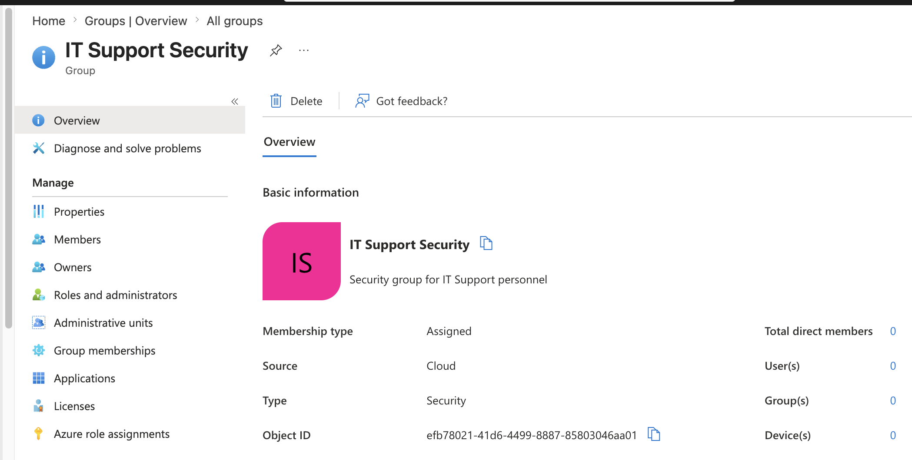
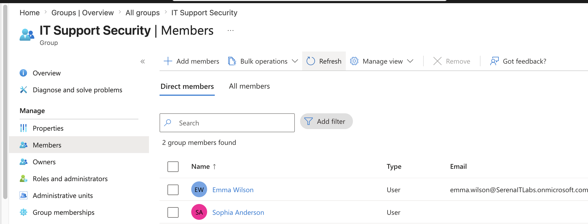
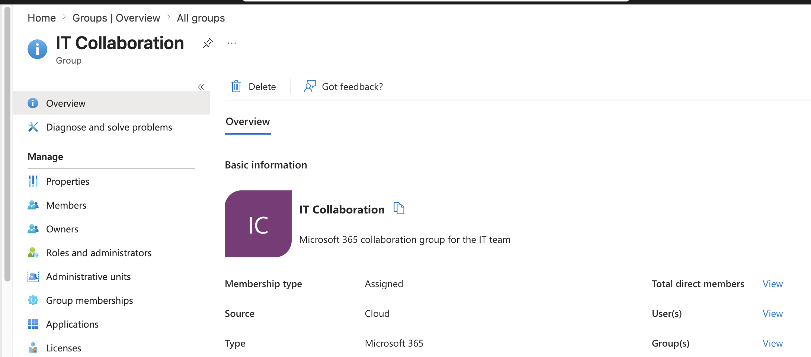
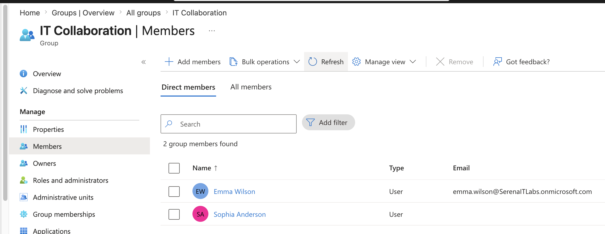
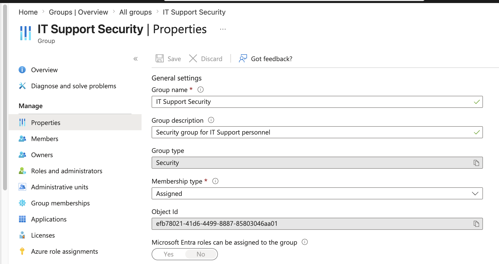
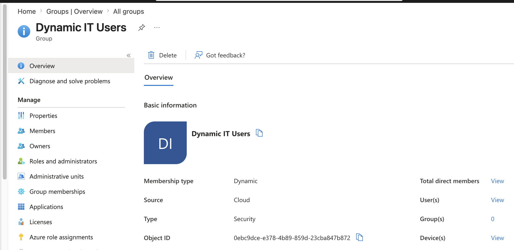
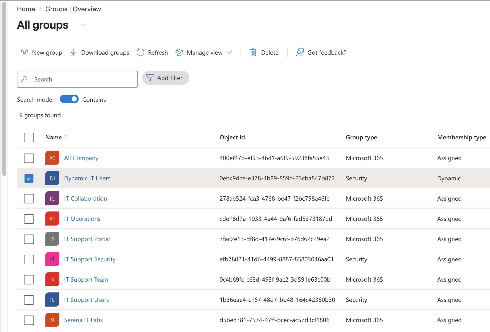

# Project 02 – Users, Groups & Dynamic Membership

## Overview

This project demonstrates Microsoft Entra ID group administration within a Microsoft 365 Business Premium environment.

The lab focused on creating and managing security groups and Microsoft 365 groups, configuring assigned membership, managing group members and ownership, reviewing group properties, and exploring dynamic user membership based on identity attributes.

---

## Scenario

An organization requires a scalable method for managing user access and collaboration.

Instead of assigning permissions individually to every employee, Microsoft Entra groups can be used to organize users according to their roles and business requirements.

As the Microsoft Entra administrator, the task is to create groups for IT personnel, configure membership, compare different group types, and explore automatic membership using dynamic membership rules.

---

## Objectives

- Create a Microsoft Entra security group
- Configure assigned group membership
- Add users to security groups
- Create a Microsoft 365 group
- Configure Microsoft 365 group membership
- Review group properties
- Understand group ownership
- Explore dynamic user membership
- Create or review an attribute-based membership rule
- Compare security and Microsoft 365 groups
- Understand assigned versus dynamic membership

---

## Lab Environment

| Component | Details |
|---|---|
| Microsoft 365 Plan | Microsoft 365 Business Premium |
| Identity Platform | Microsoft Entra ID |
| Administration Portal | Microsoft Entra Admin Center |
| Group Types | Security / Microsoft 365 |
| Membership Types | Assigned / Dynamic User |
| Environment | Cloud-based Microsoft 365 Tenant |

---

## Project Structure

```text
02-Users-Groups-and-Dynamic-Membership
├── README.md
└── Screenshots
    ├── 01_Security_Group.png
    ├── 02_Security_Group_Members.png
    ├── 03_Microsoft_365_Group.png
    ├── 04_M365_Group_Members.png
    ├── 05_Group_Properties.png
    ├── 06_Dynamic_Membership.png
    └── 07_Group_Overview.png
```

---

## Lab Steps

1. Created an assigned Microsoft Entra security group for IT Support personnel.
2. Configured group ownership.
3. Added lab users to the security group.
4. Created a Microsoft 365 collaboration group.
5. Added users to the Microsoft 365 group.
6. Reviewed group properties and membership configuration.
7. Explored dynamic user membership.
8. Configured or reviewed an attribute-based dynamic membership rule.
9. Reviewed the resulting Microsoft Entra group environment.
10. Compared the purposes of security groups and Microsoft 365 groups.

---

## 1. Security Group Creation

A Microsoft Entra security group named `IT Support Security` was created.

The group was configured using assigned membership.

```text
Group Type: Security
Group Name: IT Support Security
Membership Type: Assigned
Purpose: Access management for IT Support personnel
```

Security groups provide a scalable mechanism for organizing identities and assigning access to organizational resources.



---

## 2. Security Group Membership

Lab users were added to the `IT Support Security` group.

Users included:

- Sophia Anderson
- Emma Wilson

Instead of assigning access independently to each user, permissions can be associated with a group and managed through group membership.



---

## 3. Microsoft 365 Group

A Microsoft 365 group named `IT Collaboration` was created.

```text
Group Type: Microsoft 365
Group Name: IT Collaboration
Membership Type: Assigned
Purpose: Collaboration for IT personnel
```

Microsoft 365 groups are designed to provide membership across Microsoft 365 collaboration services.



---

## 4. Microsoft 365 Group Membership

Sophia Anderson and Emma Wilson were added as members of the `IT Collaboration` group.

This demonstrated administration of collaboration-oriented group membership through Microsoft Entra ID.



---

## 5. Group Properties

The properties of the `IT Support Security` group were reviewed.

Information examined included:

- Group name
- Group type
- Membership type
- Object ID
- Owners
- Members
- Group configuration

Reviewing group properties allows administrators to verify how a group is configured and how membership is managed.



---

## 6. Dynamic Membership

Dynamic user membership was explored as an alternative to manually assigned membership.

A department-based membership rule was used or reviewed:

```text
user.department -eq "IT"
```

This rule represents a scenario where users whose `department` attribute is set to `IT` can automatically become members of the corresponding group.

Dynamic membership can reduce manual administration when organizations maintain accurate user attributes.



---

## 7. Group Overview

The final Microsoft Entra group environment was reviewed after completing the group administration exercises.

The environment demonstrated multiple group-management approaches, including security groups, Microsoft 365 groups, and dynamic membership concepts.



---

## Security Groups vs Microsoft 365 Groups

| Feature | Security Group | Microsoft 365 Group |
|---|---|---|
| Primary Purpose | Access and security | Collaboration |
| User Membership | Yes | Yes |
| Access Management | Yes | Can support resource access |
| Microsoft 365 Collaboration | Not primary purpose | Yes |
| Assigned Membership | Supported | Supported |
| Dynamic Membership | Available when supported | Available when supported |

---

## Assigned vs Dynamic Membership

### Assigned Membership

With assigned membership, an administrator manually adds or removes users.

```text
Administrator
      ↓
Add User
      ↓
Security Group
      ↓
Resource Access
```

This provides direct administrative control but requires manual maintenance.

### Dynamic Membership

Dynamic membership evaluates user attributes against membership rules.

```text
User Identity
      ↓
Department = IT
      ↓
Dynamic Membership Rule
      ↓
Dynamic IT Group
```

This can automate group membership as user attributes change.

---

## Identity-Based Access Concept

The group structure created in this project demonstrates a fundamental identity-management model:

```text
Users
  │
  ├── Sophia Anderson
  └── Emma Wilson
          │
          ▼
      Entra Groups
          │
     ┌────┴────┐
     │         │
Security    Microsoft 365
 Group         Group
     │         │
     ▼         ▼
 Access    Collaboration
```

This approach allows organizations to manage access at the group level instead of configuring every user individually.

---

## Skills Demonstrated

- Microsoft Entra ID administration
- Security group creation
- Microsoft 365 group creation
- Group membership administration
- Group ownership
- Assigned membership
- Dynamic membership concepts
- Attribute-based membership rules
- Identity attribute awareness
- Group properties administration
- Group-based access management
- Identity and Access Management (IAM)
- Microsoft Entra Admin Center
- Access-management fundamentals
- Technical documentation

---

## Lessons Learned

- Microsoft Entra groups provide a scalable method for managing users and access.
- Security groups are primarily designed for access and security-related scenarios.
- Microsoft 365 groups support collaboration across Microsoft 365 services.
- Assigned membership requires administrators to manually manage users.
- Dynamic membership can automatically manage users according to identity attributes.
- Accurate identity attributes are important when using attribute-based access and membership.
- Group ownership separates responsibility for managing groups from general tenant administration.
- Group-based administration reduces the need to configure access independently for every user.
- Groups form an important foundation for later RBAC and Conditional Access scenarios.

---

## Next Project

**Project 03 – Administrative Roles & Role-Based Access Control (RBAC)**

The next project will focus on privileged access and Microsoft Entra administrative roles, including:

- Microsoft Entra built-in roles
- Global Administrator
- User Administrator
- Helpdesk Administrator
- Role assignments
- Least privilege
- Role-Based Access Control (RBAC)
- Administrative access verification

---

**Status:** Completed
----------------------