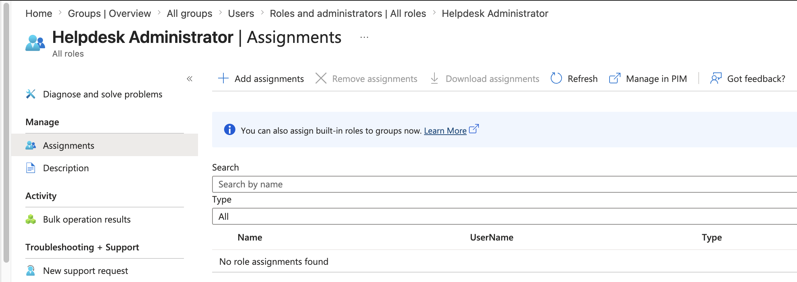
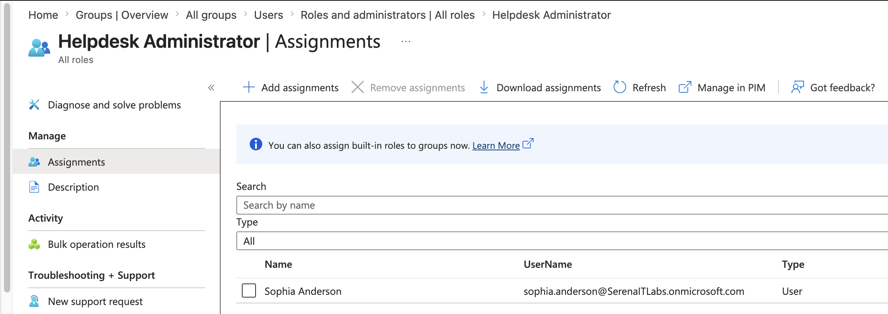
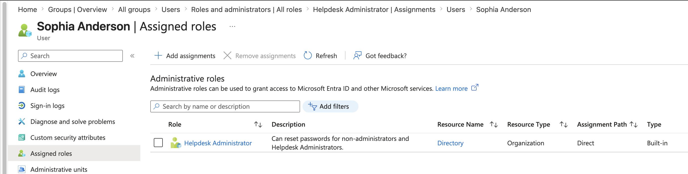
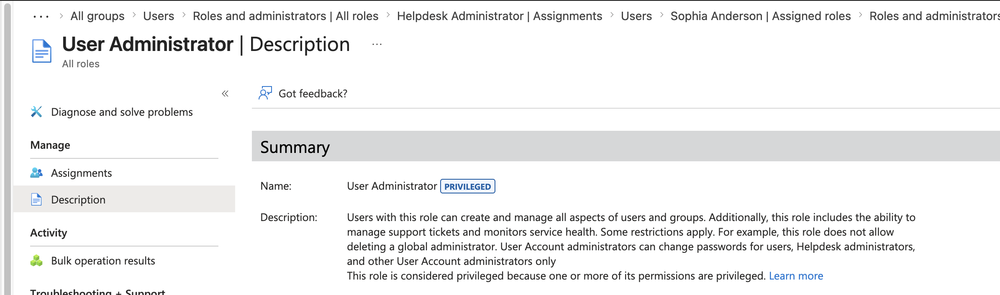
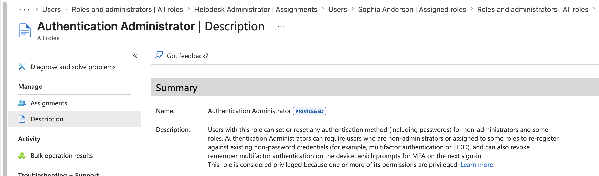
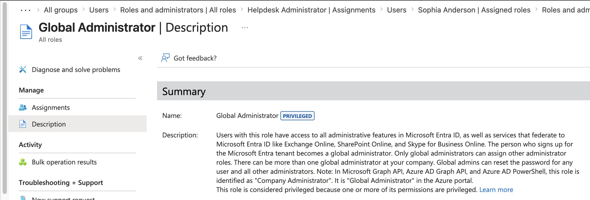
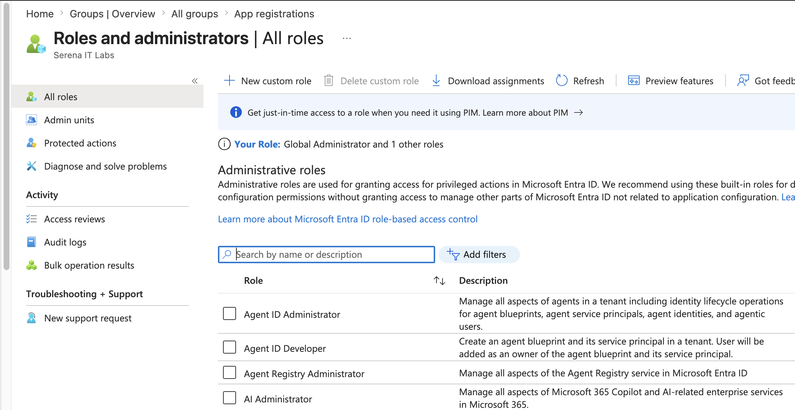
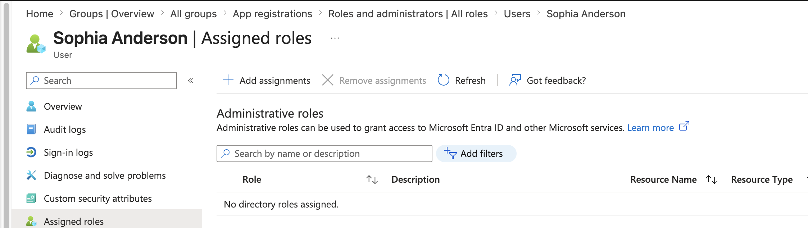

# Project 03 – Microsoft Entra Administrative Roles & RBAC

## Overview

This project demonstrates administrative role management and Role-Based Access Control (RBAC) within Microsoft Entra ID.

The lab focused on reviewing Microsoft Entra built-in administrative roles, delegating Helpdesk Administrator privileges to a standard user, verifying the role assignment, comparing administrative privilege levels, and removing the delegated role after testing.

The project demonstrates the principle of least privilege by assigning a task-appropriate administrative role instead of granting Global Administrator access.

---

## Scenario

An organization needs to provide an IT support employee with administrative capabilities to perform support-related tasks.

Granting Global Administrator access would provide significantly more privilege than required.

As the Microsoft Entra administrator, the objective was to review available administrative roles, identify a more appropriate delegated role, temporarily assign the Helpdesk Administrator role to Sophia Anderson, verify the assignment, and revoke the privilege after the administrative requirement was completed.

---

## Objectives

- Explore Microsoft Entra built-in administrative roles
- Understand Role-Based Access Control (RBAC)
- Review Helpdesk Administrator permissions
- Assign a delegated administrative role
- Verify administrative role assignment
- Review User Administrator
- Review Authentication Administrator
- Review Global Administrator
- Compare different administrative privilege levels
- Apply the principle of least privilege
- Remove an administrative role when no longer required
- Understand privileged-access lifecycle management

---

## Lab Environment

| Component | Details |
|---|---|
| Identity Platform | Microsoft Entra ID |
| Administration | Microsoft Entra Admin Center |
| Microsoft 365 Plan | Microsoft 365 Business Premium |
| Lab User | Sophia Anderson |
| Delegated Role | Helpdesk Administrator |
| Access Model | Role-Based Access Control (RBAC) |
| Environment | Cloud-based Microsoft 365 Tenant |

---

## Project Structure

```text
03-Administrative-Roles-and-RBAC
├── README.md
└── Screenshots
    ├── 01_Helpdesk_Admin_Role.png
    ├── 02_Helpdesk_Admin_Assignment.png
    ├── 03_User_Assigned_Role.png
    ├── 04_User_Admin_Role.png
    ├── 05_Authentication_Admin_Role.png
    ├── 06_Global_Admin_Role.png
    ├── 07_Entra_Admin_Roles.png
    └── 08_Role_Removed.png
```

---

## Administrative Access Workflow

The project followed a controlled privileged-access workflow:

```text
Review Administrative Requirement
             ↓
Review Available Entra Roles
             ↓
Select Appropriate Role
             ↓
Assign Helpdesk Administrator
             ↓
Verify Role Assignment
             ↓
Review Privilege Differences
             ↓
Remove Administrative Role
```

This approach reduces unnecessary privileged access within the environment.

---

## 1. Helpdesk Administrator Role

The Microsoft Entra **Helpdesk Administrator** built-in role was reviewed.

The role provides delegated administrative capabilities intended for common help desk and user-support scenarios without providing unrestricted control over the entire tenant.

This makes delegated roles more appropriate than Global Administrator for many day-to-day support responsibilities.



---

## 2. Helpdesk Administrator Assignment

The Helpdesk Administrator role was assigned to the lab user:

```text
Sophia Anderson
```

This demonstrated delegated administration through Microsoft Entra RBAC.

Instead of providing unrestricted administrative access, the user received a role designed for a narrower administrative purpose.

```text
Sophia Anderson
       ↓
Helpdesk Administrator
       ↓
Delegated Administrative Access
```



---

## 3. Role Assignment Verification

Sophia Anderson's assigned roles were reviewed after completing the role assignment.

The **Helpdesk Administrator** role appeared under the user's administrative role assignments, confirming that the delegated privilege had been successfully applied.



---

## 4. User Administrator Role

The Microsoft Entra **User Administrator** role was reviewed for comparison.

This role provides broader user-management capabilities than would be required for some routine support scenarios.

The role was reviewed but was not assigned to the lab user.



---

## 5. Authentication Administrator Role

The **Authentication Administrator** role was also reviewed.

This demonstrated that Microsoft Entra provides specialized administrative roles for different identity-management responsibilities rather than requiring administrators to use a single highly privileged role.

The role was not assigned during this project.



---

## 6. Global Administrator Role

The **Global Administrator** role was reviewed to understand the difference between delegated and highly privileged administrative access.

Global Administrator provides extensive administrative control across Microsoft Entra ID and integrated Microsoft services.

Sophia Anderson was intentionally **not** assigned this role.

This demonstrates an important security principle:

```text
Required Task
     ↓
Minimum Necessary Privilege
     ↓
Appropriate Administrative Role
```

rather than:

```text
Required Task
     ↓
Global Administrator
     ↓
Excessive Privilege
```



---

## 7. Administrative Role Comparison

The Microsoft Entra administrative role environment was reviewed to compare several built-in roles.



| Role | General Administrative Purpose |
|---|---|
| Helpdesk Administrator | Delegated support-related administration |
| User Administrator | User and group administration |
| Authentication Administrator | Authentication-related administration |
| Global Administrator | Broad tenant-level administration |

Microsoft Entra provides specialized roles so administrative permissions can be aligned with job responsibilities.

---

## 8. Administrative Role Removal

After verifying the delegated administrative assignment, the Helpdesk Administrator role was removed from Sophia Anderson.

This demonstrated the complete administrative-access lifecycle:

```text
Assign
  ↓
Verify
  ↓
Use
  ↓
Revoke
```

Removing privileges when they are no longer required reduces unnecessary administrative exposure.



---

## Role-Based Access Control (RBAC)

Role-Based Access Control provides administrative permissions according to assigned roles rather than providing every administrator with unrestricted access.

A simplified model is:

```text
User
  ↓
Administrative Role
  ↓
Defined Permissions
  ↓
Permitted Administrative Tasks
```

For example:

```text
Sophia Anderson
       ↓
Helpdesk Administrator
       ↓
Delegated Support Capabilities
```

This provides more controlled administration than assigning broad tenant-wide privileges.

---

## Least-Privilege Administration

The principle of least privilege means that users and administrators should receive only the permissions necessary to perform their required responsibilities.

In this project:

```text
Global Administrator
        ❌
Not required

Helpdesk Administrator
        ✓
Delegated for the lab scenario
```

Using specialized administrative roles can reduce the security impact of compromised administrative accounts and accidental configuration changes.

---

## Privileged Access Lifecycle

Administrative access should not only be controlled when it is assigned.

The complete lifecycle should include:

```text
Administrative Requirement
          ↓
Role Selection
          ↓
Privilege Assignment
          ↓
Verification
          ↓
Administrative Activity
          ↓
Privilege Review
          ↓
Privilege Removal
```

This project demonstrated both the assignment and removal stages of that lifecycle.

---

## Security Principles Demonstrated

### Least Privilege

Only the administrative permissions appropriate to the scenario were delegated.

### Role-Based Administration

Administrative permissions were provided through a Microsoft Entra built-in role.

### Separation of Responsibilities

Different administrative functions can be assigned through specialized roles instead of relying entirely on Global Administrator.

### Privilege Revocation

Administrative access was removed after the delegated requirement was completed.

### Reduced Administrative Exposure

Limiting the number and privilege level of administrative accounts can reduce organizational security risk.

---

## Skills Demonstrated

- Microsoft Entra ID administration
- Role-Based Access Control (RBAC)
- Microsoft Entra built-in roles
- Administrative role assignment
- Administrative role removal
- Helpdesk Administrator
- User Administrator awareness
- Authentication Administrator awareness
- Global Administrator awareness
- Delegated administration
- Least-privilege access
- Privileged-access management fundamentals
- Identity and Access Management (IAM)
- Microsoft Entra Admin Center
- Administrative access verification
- Security administration
- Technical documentation

---

## Lessons Learned

- Microsoft Entra provides built-in administrative roles for different operational responsibilities.
- Global Administrator should not be used when a less-privileged role can satisfy the administrative requirement.
- Help desk personnel can be provided with delegated administrative capabilities without granting unrestricted tenant control.
- Role assignments should be verified after configuration.
- Administrative access should be reviewed and removed when it is no longer required.
- RBAC helps organizations separate administrative responsibilities.
- Least privilege reduces unnecessary administrative exposure.
- Administrative access management includes both provisioning and deprovisioning privileges.
- Identity administration requires balancing operational requirements with security controls.

---

## Portfolio Progression

```text
Project 01
Tenant & Identity Administration
        ↓
Project 02
Users, Groups & Dynamic Membership
        ↓
Project 03
Administrative Roles & RBAC
        ↓
Project 04
MFA & Authentication Methods
        ↓
Project 05
Conditional Access
        ↓
Project 06
Sign-In Logs & Identity Troubleshooting
        ↓
Project 07
Enterprise Identity Case Study
```

---

## Next Project

**Project 04 – MFA & Authentication Methods**

The next project will focus on Microsoft Entra authentication security, including:

- Authentication methods
- Microsoft Authenticator
- Multi-Factor Authentication (MFA)
- Authentication method policies
- MFA registration
- Authentication verification
- Authentication security concepts

---

**Status:** Completed