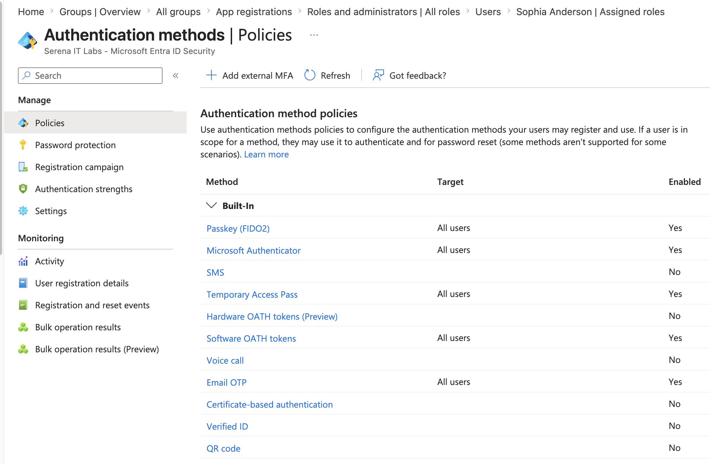
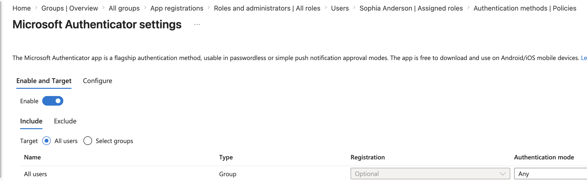
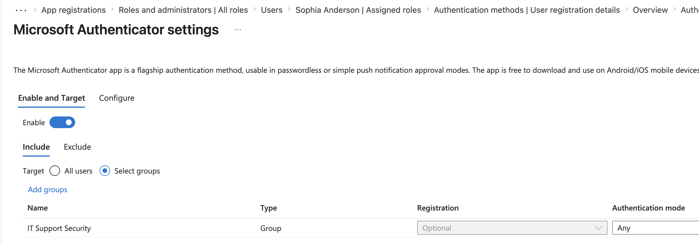
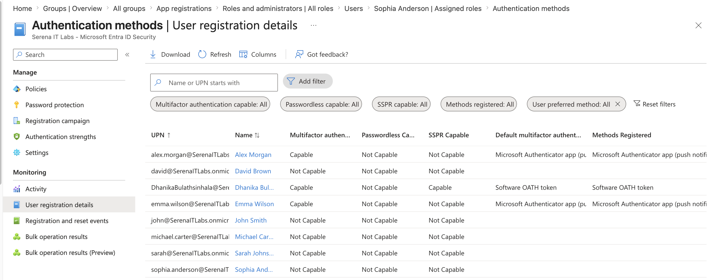
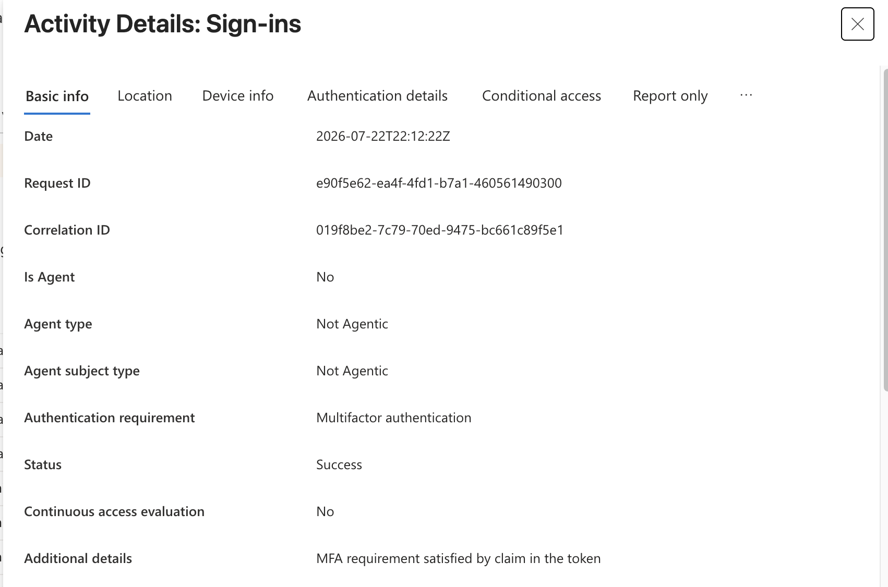
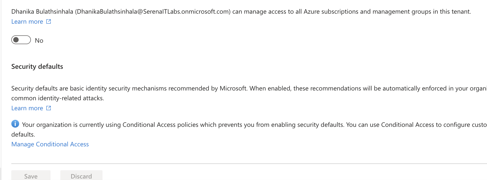

# Project 04 – MFA and Authentication Methods

## Overview

This project demonstrates Microsoft Entra ID authentication administration within a Microsoft 365 environment.

The lab focused on reviewing available authentication method policies, configuring Microsoft Authenticator settings, targeting an IT Support security group, reviewing user registration details, examining sign-in logs, and reviewing tenant security defaults.

---

## Scenario

An organization wants to strengthen user authentication and improve visibility into sign-in activity.

As the Microsoft 365 administrator, the task is to review available authentication methods, configure Microsoft Authenticator for a designated security group, verify registration information, inspect sign-in activity, and review tenant-wide security defaults.

---

## Objectives

- Review authentication method policies
- Configure Microsoft Authenticator settings
- Target a security group for Microsoft Authenticator
- Review MFA registration details
- Review user sign-in activity
- Review Security Defaults
- Gain practical experience with Microsoft Entra authentication administration

---

## Lab Environment

| Component | Details |
|---|---|
| Microsoft 365 Plan | Microsoft 365 Business Premium |
| Administration Portal | Microsoft Entra Admin Center |
| Identity Platform | Microsoft Entra ID |
| Authentication Method | Microsoft Authenticator |
| Target Group | IT Support Users |
| Environment | Cloud-based Microsoft 365 Tenant |

---

## Project Structure

```text
04-MFA-and-Authentication-Methods
├── README.md
└── Screenshots
    ├── 01_Authentication_Method_Policies.png
    ├── 02_Microsoft_Authenticator_Settings.png
    ├── 03_IT_Support_Security_Group.png
    ├── 04_User_Registration_Details.png
    ├── 05_Sign_In_Logs.png
    └── 06_Security_Defaults.png
```

---

## Lab Steps

1. Accessed the Microsoft Entra Admin Center.
2. Reviewed the available Authentication Method Policies.
3. Opened the Microsoft Authenticator policy configuration.
4. Reviewed Microsoft Authenticator settings.
5. Added the `IT Support Users` security group as a target for the Microsoft Authenticator policy.
6. Reviewed user registration details for authentication methods and MFA.
7. Reviewed sign-in logs for user authentication activity.
8. Reviewed the tenant Security Defaults configuration.

---

## Authentication Method Policies

The Authentication Methods policy interface was reviewed to identify the authentication methods available within the tenant.



---

## Microsoft Authenticator Settings

Microsoft Authenticator settings were reviewed to understand how administrators configure authentication behavior and targeting.



---

## IT Support Security Group Targeting

The existing `IT Support Users` security group was added to the Microsoft Authenticator policy.

This demonstrated group-based targeting of authentication policies within Microsoft Entra ID.



---

## User Registration Details

User registration information was reviewed to understand MFA and authentication-method registration status.



---

## Sign-In Logs

Sign-in logs were reviewed to examine authentication activity and user sign-in status.

This is useful for troubleshooting authentication and access-related incidents.



---

## Security Defaults

Tenant Security Defaults were reviewed to understand the baseline identity security configuration available within Microsoft Entra ID.



---

## Skills Demonstrated

- Microsoft Entra ID administration
- MFA administration
- Authentication Methods policy management
- Microsoft Authenticator configuration
- Security group targeting
- Authentication registration monitoring
- Sign-in log analysis
- Security Defaults review
- Identity and access troubleshooting
- Microsoft 365 security administration

---

## Lessons Learned

- Authentication Methods policies provide centralized control over available sign-in methods.
- Microsoft Authenticator can be targeted to specific security groups.
- Group-based policy targeting provides more scalable identity management than configuring users individually.
- User registration details provide visibility into MFA readiness and authentication-method enrollment.
- Sign-in logs are important for investigating authentication and access issues.
- Security Defaults provide baseline identity protection within Microsoft Entra ID.
- MFA and authentication configuration are core responsibilities in Microsoft 365 and identity administration.

---

## Next Project

**Project 05 – Conditional Access**

The next project focuses on creating and reviewing Conditional Access policies, including safe testing using Report-only mode.

---

**Status:** Completed