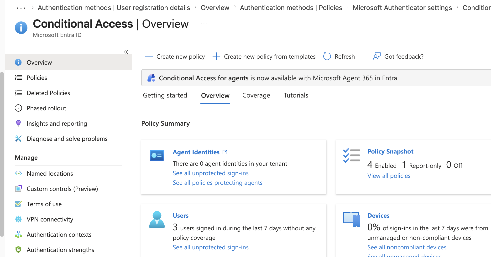
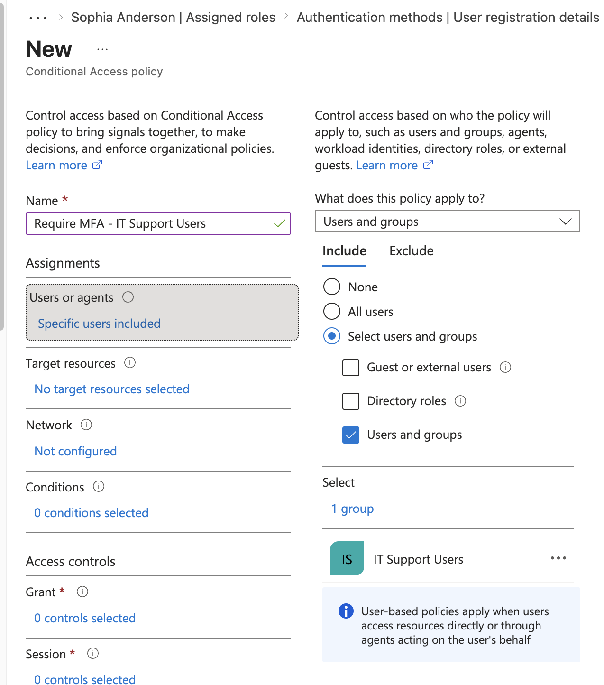
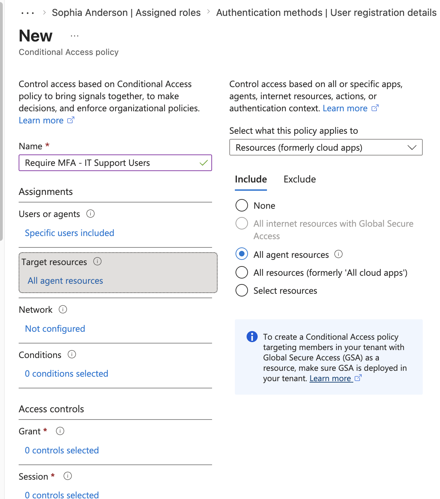
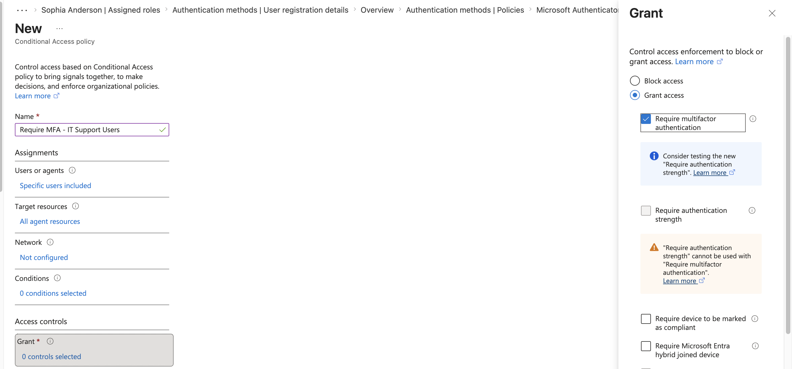
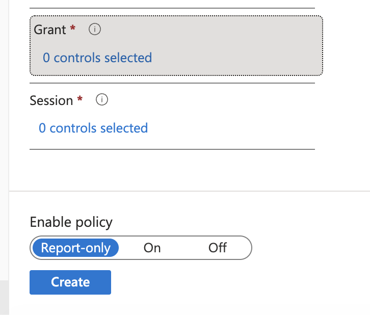
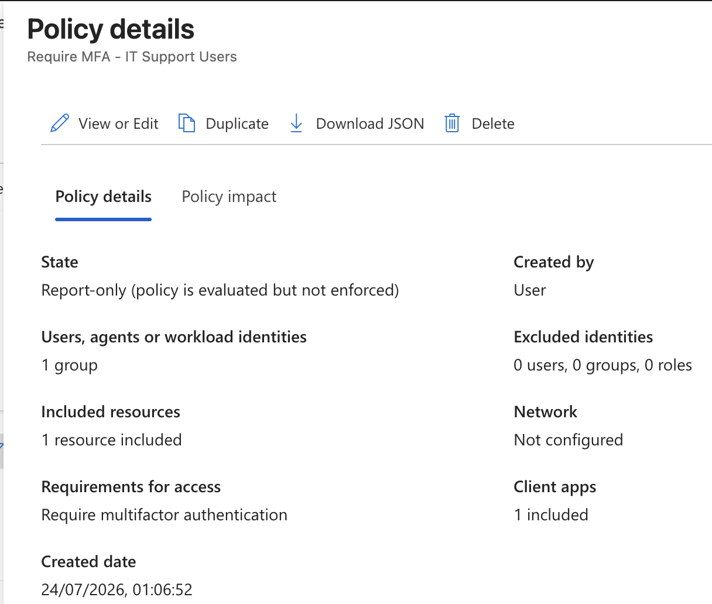

# Project 05 – Conditional Access

## Overview

This project demonstrates the configuration of a Microsoft Entra Conditional Access policy within a Microsoft 365 environment.

The lab focused on creating a group-targeted Conditional Access policy requiring multifactor authentication (MFA) for IT Support users while using Report-only mode for safe policy testing before enforcement.

---

## Scenario

The organization wants to strengthen access security for members of the IT Support team.

As the Microsoft 365 administrator, the task is to create a Conditional Access policy targeting the existing `IT Support Users` security group and require MFA when members access organizational cloud resources.

The policy was initially deployed in Report-only mode to allow evaluation without immediately enforcing the access control.

---

## Objectives

- Navigate Microsoft Entra Conditional Access
- Create a Conditional Access policy
- Target an existing security group
- Configure cloud-resource targeting
- Require multifactor authentication
- Use Report-only mode for safe policy deployment
- Verify the completed Conditional Access policy

---

## Lab Environment

| Component | Details |
|---|---|
| Platform | Microsoft Entra ID |
| Administration Portal | Microsoft Entra Admin Center |
| Target Group | IT Support Users |
| Access Control | Multifactor Authentication |
| Deployment Mode | Report-only |
| Environment | Microsoft 365 Business Premium Tenant |

---

## Project Structure

```text
05-Conditional-Access
├── README.md
└── Screenshots
    ├── 01_Conditional_Access_Policies.png
    ├── 02_Target_IT_Support_Group.png
    ├── 03_Target_Resources.png
    ├── 04_Require_MFA.png
    ├── 05_Report_Only_Mode.png
    └── 06_MFA_Policy_Created.png
```

---

## Conditional Access Policies

The Microsoft Entra Conditional Access interface was reviewed before creating the new access policy.



---

## Security Group Targeting

A Conditional Access policy named:

`Require MFA - IT Support Users`

was created.

The existing `IT Support Users` security group was selected as the target population.



---

## Target Resources

The policy was configured to apply to organizational cloud resources.

This allows Conditional Access controls to evaluate authentication when targeted users access protected resources.



---

## Require Multifactor Authentication

The Grant access controls were configured to require multifactor authentication.

This adds an additional authentication requirement beyond a user's password.



---

## Report-Only Deployment

The Conditional Access policy was initially configured in `Report-only` mode.

Report-only deployment allows administrators to evaluate how a Conditional Access policy would affect user sign-ins before enabling enforcement.

This reduces the risk of unintentionally disrupting user access.



---

## Policy Verification

The completed policy was verified in the Conditional Access policy list with Report-only status.



---

## Skills Demonstrated

- Microsoft Entra ID administration
- Conditional Access policy creation
- Group-based policy targeting
- MFA access controls
- Cloud-resource protection
- Report-only policy deployment
- Identity and access management
- Microsoft 365 security administration
- Access-control planning
- Safe security-policy testing

---

## Lessons Learned

- Conditional Access combines identity and access signals to control access to organizational resources.
- Policies can be targeted to specific security groups rather than configured individually for each user.
- MFA can be required through Conditional Access to strengthen account security.
- Report-only mode allows administrators to evaluate policies before enforcement.
- Careful targeting and testing are important because incorrectly configured Conditional Access policies can disrupt legitimate access.
- Conditional Access provides more granular access control than relying solely on baseline tenant security settings.

---

## Next Project

**Project 06 – Sign-In and Identity Troubleshooting**

The next project focuses on investigating user sign-ins, authentication details, failures, and Conditional Access information using Microsoft Entra logs.

---

**Status:** Completed