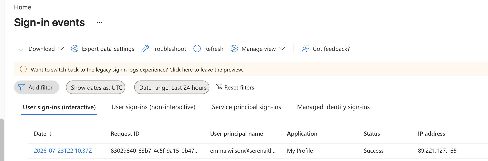
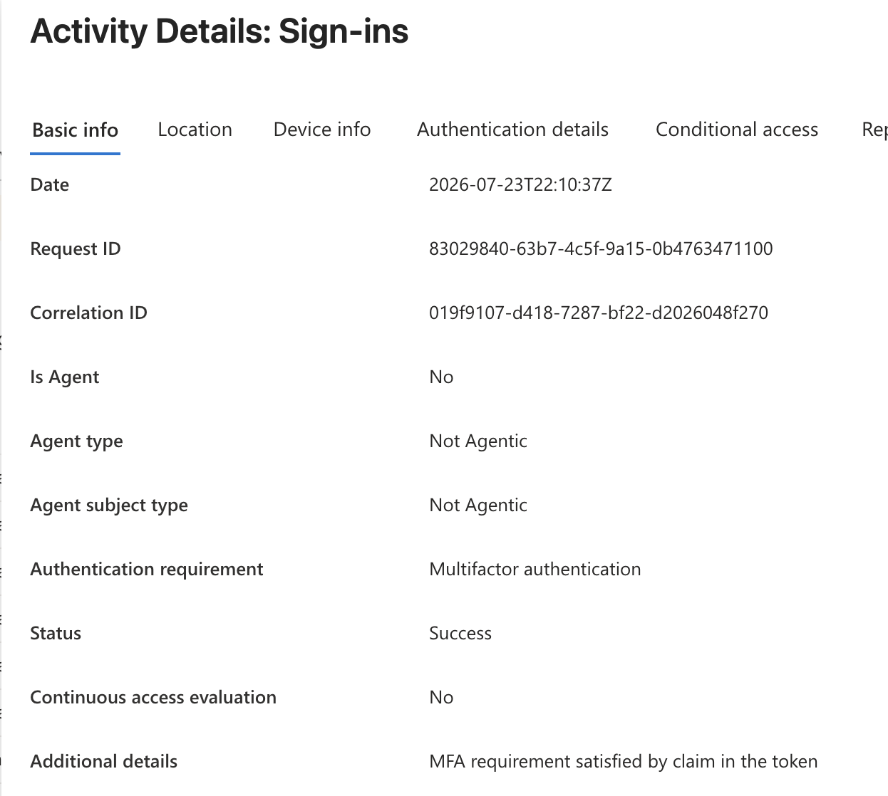
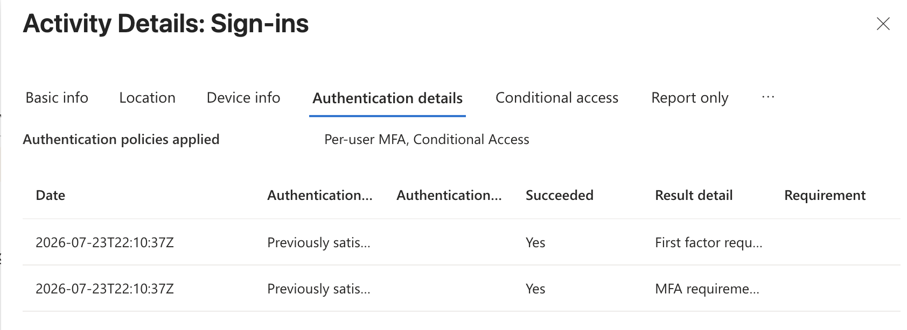
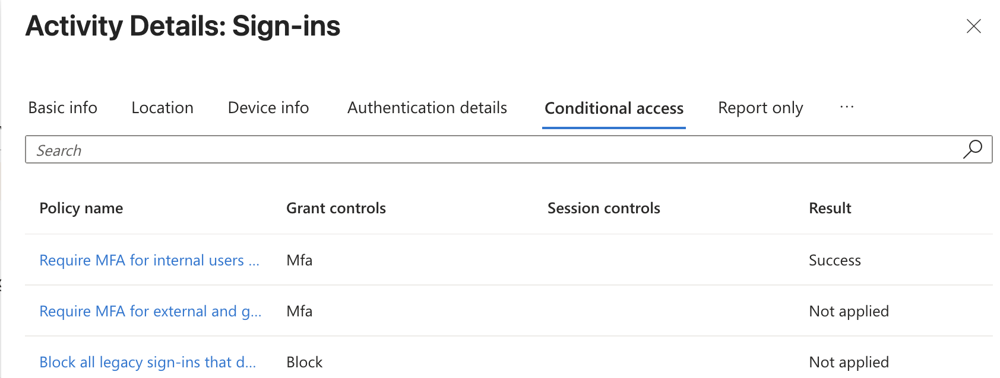
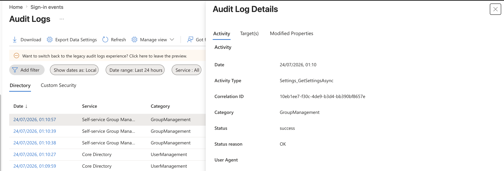

# Project 06 – Sign-In & Identity Troubleshooting

## Overview

This project demonstrates identity and authentication troubleshooting using Microsoft Entra ID.

The lab focused on investigating user sign-in activity, reviewing authentication details, examining Conditional Access evaluations, and using audit logs to investigate administrative changes within the tenant.

---

## Scenario

A user reports an authentication or Microsoft 365 access issue.

As the administrator, the task is to investigate Microsoft Entra sign-in logs, examine authentication information, review Conditional Access evaluation results, and use audit logs to identify relevant administrative activity.

---

## Objectives

- Review Microsoft Entra sign-in logs
- Investigate individual sign-in events
- Review authentication details
- Examine Conditional Access evaluation
- Investigate Microsoft Entra audit logs
- Understand the difference between sign-in and audit logs
- Develop practical identity troubleshooting skills

---

## Lab Environment

| Component | Details |
|---|---|
| Platform | Microsoft Entra ID |
| Administration Portal | Microsoft Entra Admin Center |
| Monitoring | Sign-in Logs and Audit Logs |
| Access Control | Conditional Access |
| Environment | Microsoft 365 Business Premium Tenant |

---

## Project Structure

```text
06-Sign-In-and-Identity-Troubleshooting
├── README.md
└── Screenshots
    ├── 01_Sign_In_Logs.png
    ├── 02_Sign_In_Details.png
    ├── 03_Authentication_Details.png
    ├── 04_Conditional_Access_Evaluation.png
    └── 05_Audit_Log_Investigation.png
```

---

## Sign-In Logs

Microsoft Entra sign-in logs were reviewed to examine authentication activity within the tenant.

Sign-in logs provide information about users, applications, authentication requirements, sign-in status, and access activity.



---

## Sign-In Investigation

An individual user sign-in event was examined in greater detail.

The investigation included reviewing the user, application, authentication requirement, sign-in status, and other information associated with the authentication attempt.



---

## Authentication Details

Authentication details associated with the sign-in event were reviewed.

This information can help administrators understand the authentication methods and steps involved during a user's sign-in process.



---

## Conditional Access Evaluation

The Conditional Access information associated with the sign-in was reviewed to understand how access policies were evaluated during authentication.

This is particularly useful when troubleshooting access problems caused by identity security policies.



---

## Audit Log Investigation

Microsoft Entra audit logs were reviewed to investigate administrative activity within the tenant.

Audit logs provide visibility into changes made to identities, groups, policies, and other Microsoft Entra resources.



---

## Sign-In Logs vs Audit Logs

| Sign-In Logs | Audit Logs |
|---|---|
| Track authentication activity | Track administrative changes |
| Show user sign-in attempts | Show configuration changes |
| Help investigate access failures | Help identify who changed a resource |
| Include authentication information | Include activity, target, initiator, and result |
| Support identity troubleshooting | Support administrative auditing |

---

## Skills Demonstrated

- Microsoft Entra ID troubleshooting
- Sign-in log analysis
- Authentication troubleshooting
- MFA troubleshooting
- Conditional Access investigation
- Audit log analysis
- Identity monitoring
- Access troubleshooting
- Microsoft 365 identity administration

---

## Lessons Learned

- Sign-in logs provide detailed information for investigating user authentication and access issues.
- Authentication details can help identify which authentication methods and steps were involved during sign-in.
- Conditional Access results help determine whether security policies affected a user's access.
- Audit logs provide visibility into administrative and configuration changes.
- Sign-in logs and audit logs serve different troubleshooting purposes and can be used together during identity investigations.
- Microsoft Entra monitoring tools are valuable for diagnosing Microsoft 365 authentication and access incidents.

---

## Next Project

**Project 07 – Enterprise Applications & Access Management**

The next project focuses on Enterprise Applications, application assignments, and user/group access management within Microsoft Entra ID.

---

**Status:** Completed